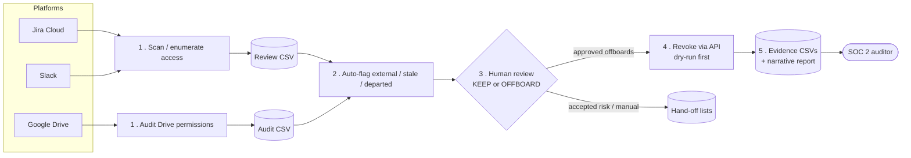

# SOC 2 Access Reviews

[](../../actions/workflows/ci.yml)
[](./LICENSE)
[](https://www.python.org/)

**A practical, runnable toolkit for the access-review evidence that SOC 2 (and most security frameworks) demand — across Google Workspace, Atlassian Jira, and Slack.**

If you are responsible for SOC 2 compliance at an organization that runs on **Google Workspace, Jira Cloud, and Slack**, this is for you. Auditors expect you to prove, every quarter, that you know who has access to what, that you remove access that shouldn't be there, and that you have the evidence to show for it. Doing that by hand across three platforms is slow, error-prone, and hard to document. These tools turn it into a repeatable, evidence-producing workflow.

---

## What this gives you

A repeatable **audit → review → remediate → prove** loop for each platform. Concretely, the tooling helps you:

1. **Enumerate access.** Scan every user, group, project role, channel, and shared-drive permission across Jira, Slack, and Google Drive — and export it to CSV.
2. **Flag the risky access automatically.** External-domain shares, stale (>180-day) permissions, and deactivated-but-still-present accounts are surfaced for you so you review signal, not noise.
3. **Review with a human in the loop.** A person marks each row `KEEP` or `OFFBOARD` (or moves it to an "accepted risk" / "manual cleanup" bucket). The tools never revoke anything you didn't approve.
4. **Remediate safely.** Revoke the approved rows through each platform's API — with a **dry-run mode** so you preview every change before it happens.
5. **Produce the evidence.** Every scan and every revocation is written to timestamped CSVs and a narrative report you can hand directly to your auditor as the proof that the review happened.

The result is a defensible evidence trail — before/after snapshots plus per-action logs — for each quarterly access review.

---

## How it works



Each platform follows the same **audit → review → remediate → prove** loop; the two subprojects implement it for their respective APIs.

---

## ⚠️ This is admin tooling

These scripts do exactly what a security review requires: they **read and remove access across your entire organization**. That means they need the **highest privilege level** on each platform:

- **Google Workspace** — a service account with **domain-wide delegation** impersonating a **super admin**.
- **Jira Cloud** — a **site-admin** API token.
- **Slack** — a workspace **admin/owner** bot token.

Run them only if you are (or are acting on behalf of) an administrator of these platforms, and treat the credentials accordingly. Destructive steps are gated behind dry-runs and human-reviewed CSVs — read each tool's README before you run a revoke.

---

## 🤖 Built with, and best run inside, Claude Code

This toolkit was **designed, built, and operated with [Claude Code](https://claude.com/claude-code)**, Anthropic's agentic coding tool. The recommended way to use it is **inside a Claude Code terminal session**: open the repo in Claude Code and drive the workflow conversationally — "scan Jira and Slack," "summarize the external shares," "dry-run the revoke and show me what would change." Each subproject ships a `CLAUDE.md` and `AGENTS.md` so the agent already understands the architecture, the safe order of operations, and where the evidence lands.

You can also run everything as plain Python from a normal shell — the commands are documented — but the human-in-the-loop review steps go much faster with an agent helping you triage.

---

## The two tools

| Subproject | Platforms | What it does |
|---|---|---|
| [`jira-slack-access-managers/`](./jira-slack-access-managers/) | Jira Cloud + Slack | A `scan` / `revoke` CLI that enumerates users and access, exports review CSVs, and revokes approved offboards. |
| [`shared-drive-file-review/`](./shared-drive-file-review/) | Google Drive (Shared Drives) | Standalone scripts that audit Drive permissions, trace inherited shares to their source folder, and revoke external/stale access. |

Each has its own README with full setup and a step-by-step quarterly runbook. Start there:

- **[Jira & Slack →](./jira-slack-access-managers/README.md)**
- **[Google Shared Drive →](./shared-drive-file-review/README.md)**

---

## Quick start

```bash
git clone <your-repo-url> soc2-access-reviews
cd soc2-access-reviews

# Pick a tool and follow its README:
cd jira-slack-access-managers   # or: cd shared-drive-file-review
python -m venv venv && source venv/bin/activate
pip install -r requirements.txt
```

For development (lint, format, byte-compile), use the Makefile from the repo root:

```bash
make install-dev    # installs ruff
make check          # lint + format check + compile (what CI runs)
```

Both subprojects ship **synthetic sample data** (clearly fake `*_sample.csv` files and example reports) so you can see the input/output shapes before pointing the tools at real credentials.

---

## Repository layout

```
soc2-access-reviews/
├── README.md                     ← you are here
├── LICENSE                       ← MIT
├── Makefile                      ← make lint / format / compile / check
├── requirements-dev.txt          ← dev tooling (ruff)
├── ruff.toml                     ← lint + format config
├── .github/workflows/ci.yml      ← lint, format check, byte-compile
├── jira-slack-access-managers/   ← Jira + Slack scan/revoke CLI
└── shared-drive-file-review/     ← Google Drive permission audit + remediation
```

## Security notes

- **No real credentials or customer data** are in this repository. The working `input/` and `output/` directories are gitignored; only synthetic `*_sample` files are checked in.
- Provide your own secrets via `.env` (local dev) or GCP Secret Manager, and your own `service_account.json` for the Drive tool. Both are gitignored — keep it that way.
- Rotate any token or key the moment it might have been exposed.

## About this project

I built and operated this tooling to run real quarterly SOC 2 access reviews across Google Workspace, Jira, and Slack — turning a manual, multi-platform compliance chore into a repeatable, evidence-producing workflow. This is a generalized, fully sanitized version published as a portfolio piece: all organization-specific names, credentials, and data have been removed and replaced with synthetic examples. It's shared in the hope it's a useful starting point for anyone facing the same audit each quarter.

## License

[MIT](./LICENSE) — provided as-is, with no warranty. You are responsible for how you use it against your own systems.
